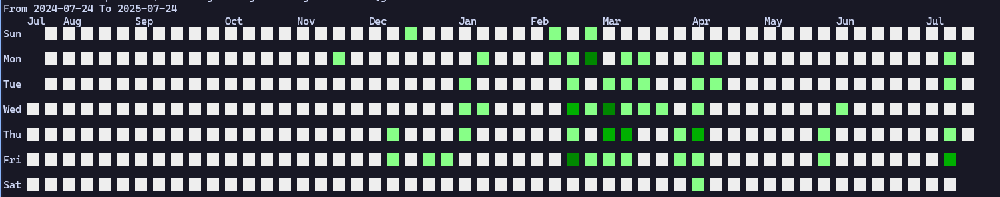

# README

## This is a simple CLI tool that displays the your git contribution heatmap.

Github already has a heatmap feature, but it's all based on remote repositories, and isn't it correct that local stuff are the real deal :] (and also for education purposes too)

This tool is a simple CLI tool that displays your git contribution heatmap for your local repositories.

## Usage

```bash
go run main.go --help
```

```bash
go run main.go --dir /your/git/repositiories/parent/directory --author-email your.email@example.com
```

## Example



## TODO

- [ ] Add support for multiple parent directories
- [x] Add support for custom year or time range
- [ ] Use the standard project layout
